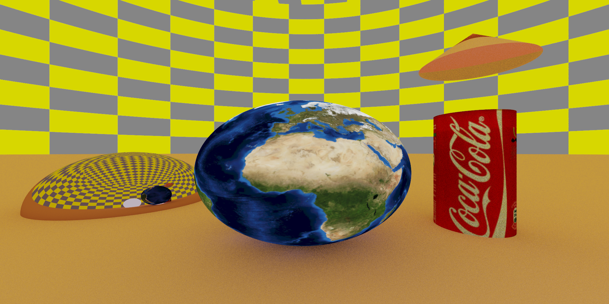
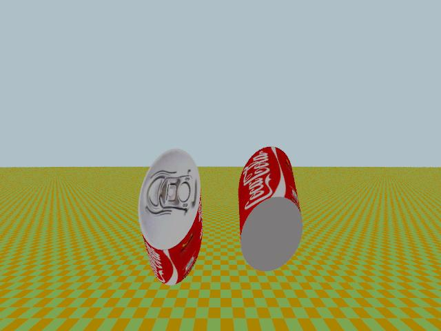

 
 <h1 align="center">  NM4PIG </h1> <br>
 
 [](https://github.com/andreasala98/NM4PIG/actions/workflows/test.yml)
 [](https://github.com/andreasala98/NM4PIG/actions/workflows/docfx-build-publish.yml)
 [](./LICENSE)
 [](https://GitHub.com/andreasala98/NM4PIG/graphs/contributors/)
[](https://GitHub.com/andreasala98/NM4PIG/graphs/commit-activity)


Welcome to NM4PIG!
This is a raytracing library written in C#. It was developed for the course _Numerical Methods for Photorealistic Image Generation_ held by Prof. [Maurizio Tomasi][1] at Università degli Studi di Milano (A.Y. 2020-2021).

The contibutors to the project are [Tommaso Armadillo][2], [Pietro Klausner][3] and [Andrea Sala][4].

## Table of Contents

- [Overview](#overview)
- [Prerequisites](#prerequisites)
- [Usage](#usage)
    - [Render mode](#render-mode)
    - [How to create input files](#how-to-create-input-files)
    - [Demo mode](#demo-mode)
    - [Convert mode](#convert-mode)
- [Documentation](#documentation)
- [License](#license)
- [Gallery](#gallery)
- [Issue tracking](#issue-tracking)

## Overview
👀

The main funcitonality of this library is to produce photorealistic images from input files describing a certain scene. 
The scene is made of geometric shapes (see the list of available shapes), each one defined by its coordinates and its material. Our code offers the possibility to choose between a diffusive, emissive or reflective material. 
The code implements four different _backwards ray tracing_ algorithms to simulate how light rays propagate. A camera (perspective or orthogonal) representing the observer will see the world through a 2D screen placed ahead of it and it is defined by its position, the distance from the screen and the aspect ratio.

Once everything (shapes and observer) is defined and in place, the code solves the rendering equation (with different assumptions, depending on the chosen algorithm) and produces an HDR image (in `.pfm` format). Later, the HDR image is converted into LDR formats such as `.jpg`and `.png`.


## Prerequisites
💻

This library has been developed and tested with .NET version 5.0.x. It is possible to download the latest version [here](https://dotnet.microsoft.com/download).

This library uses some external libraries. The user should not worry as .NET automatically imports them with the repository download. The libraries are listed below:

- [ImageSharp][5] to convert `.pfm` images into LDR formats
- [CommandLineUtils][8] to handle Command Line Interface
- [ShellProgressBar][9] to show a nice progress bar while rendering

## Usage
⚙️

In order to use the library you can clone the repository:

    git clone git@github.com:andreasala98/NM4PIG.git

To check that the code works as expected, you can run a set of tests using the following command:

    dotnet test

### Render mode
✨


Our program is developed to be used mainly in _render_ mode. This mode reads an external file with instructions for the scene, and then performs photorealistic ray tracing according to the specified parameters. In order to use render mode, you can run the following command (from the NM4PIG/NM4PIG folder):

    dotnet run -- render --scene Examples/Inputs/dummy.txt -ldr Examples/dummy.jpg

This command will read the instructions present in the file ```dummy.txt``` and generate an image called ```dummy.jpg```. Feel free to use your preferred editor to visualize the image generated. If you want to explore all the settable parameters, you can run

    dotnet run -- render -?
    
The complete list of settable parameters is:
- `--file| <FILENAME>` : name (path) of the input file with instructions. Default is `dummy.txt`
- `--width|-W <WIDTH>` and `--height|-H <HEIGHT>` : set the dimensions of the generated image. Default is 640x480
- `--pfmfile|-pfm <FILENAME>` : name (path) of the `.pfm` output file. This file can be used as input in [Convert mode](#convert-mode) Default is `demoImage.pfm`
- `--ldrfile|-ldr <FILENAME>`: name (path) of the `.png` or `.jpg` output file. Default is `demoImage.jpg`
- `--samples-per-pixel|-spp <SAMPLES>` : number of extracted samples per pixel (to perform antialiasing). Default is 4
- `--render-type|-rnd <CHAR>` : rendering algorithm to be used 
  (On-Off renderer: 'o', Flat renderer: 'f', Pointlight renderer: 'p', Path tracer: 'r'). Default is 'r'
- `--declare-float|-d ` : Override a variable value from the command line. The syntax is `--declare-float VAR:VALUE`

⚠️ The following three parameters are advanced parameters. Change them only if you know what you are doing! A wrong settage of these parameters could cause the execution to be extremely long!

- `--max-depth|-md <INT>` : max number of reflections for each ray. Default is 3
- `--n-rays|-n <INT>` : number of rays sampled at each reflection. Default is 10
- `--russian-roulette|-rr <INT>` : number of reflections beyond which the [Russian Roulette Algorithm](https://www.pbr-book.org/3ed-2018/Monte_Carlo_Integration/Russian_Roulette_and_Splitting) is used. Default is 2


### How to create input files

Input files must be written according to specific syntactic rules.
We prepared some tutorial files to explain how these input files should be created:

- [Tutorial 1](./NM4PIG/Examples/Inputs/Scene_1/scene1.txt) ([Result](./NM4PIG/Examples/Inputs/Scene_1/scene1.jpg))
- [Tutorial 2](./NM4PIG/Examples/Inputs/Scene_2/scene2.txt) ([Result](./NM4PIG/Examples/Inputs/Scene_2/scene2.jpg))
- [Tutorial 3 (flat renderer)](./NM4PIG/Examples/Inputs/Scene_3/scene3flat.txt) ([Result](./NM4PIG/Examples/Inputs/Scene_3/scene3flat.jpg))
- [Tutorial 4 (point light renderer)](./NM4PIG/Examples/Inputs/Scene_4/scene4.txt) ([Result](./NM4PIG/Examples/Inputs/Scene_4/scene4.jpg))

Each file has in the same directory the image produced. Once you've learned how to write an input file, you can start creating your own images!


### Demo mode
🎮


To run the application and visualize a simple image, use the following command (from the NM4PIG/NM4PIG directory):

    dotnet run -- demo

The command uses some default parmaeters. Feel free to explore all the possible options and to use the most suitable for you

    dotnet run -- demo -?

It is also possible to vary the angle of the camera in degrees (-a <ANGLE>) in order to obtain something like the image shown (see `Examples/Animations/`)

##### Available shapes

It is allowed to add any of the following shapes to the environment:
- Spheres 🏀
- Planes ✈️ (joking, actually these kinds of planes ◻️)
- Boxes 📦
- Cones 🍦
- Cylinders 🎩
- Constructive Solid Geometry 💎(CSG): Union, Intersection and Difference of any pair of shapes of the ones mentioned above
- [Wikishape](https://upload.wikimedia.org/wikipedia/commons/8/8b/Csg_tree.png) (a particular case of CSG mixtures)

Each shape can be transformed upon creation with a composition of scaling, translations and rotations around any of the three axes.

### Convert mode
🔁

To convert an existing `.pfm` file into a `.png` or `.jpg` file, type the following command (if no arguments are passed some default values are used):
 
    dotnet run -- convert -f <FACTOR> -g <GAMMA>
    
To clean NM4PIG directory from generated `.png` and `.jpg` samples, type  `./clean.sh`. If you want to keep an image, make sure to move it to another folder. This will prevent your image from being deleted.

## Documentation
📑

A webpage with all the documentation is available at [this link][7]. This webpage is generated with DocFX. [Learn more][6]. Any suggestion to improve the documentation website is welcome!


## License
⚖️

The code is released under a MIT license. See the file [LICENSE](./LICENSE)
 
 
 ## Gallery
 
 Here is a small gallery of some images generated with NM4PIG:
 
 <p float="center">
  
   
  
  
</p>
 
  <p float="center">
  
   
  </p>
 
 <p float="center">
  
  
   
</p>
 
Now it's time to build your own! Have fun!
 
 
## Issue tracking
 
If you happen to find any issue or bug with our code, you're more than welcome to let us know. Either [contact us via email](mailto:andrea.sala98@gmail.com,tommaso.armadillo@studenti.unimi.it,pietro.klausner@studenti.unimi.it) or raise an issue with the apposite issue tracker. We guarantee maintenance up until September 2021.
 

 


[1]: https://github.com/ziotom78
[2]: https://github.com/TommasoArmadillo
[3]: https://github.com/PietroKlausner
[4]: https://github.com/andreasala98
[5]: https://docs.sixlabors.com/articles/imagesharp/index.html?tabs=tabid-1
[6]: https://dotnet.github.io/docfx/
[7]: https://andreasala98.github.io/NM4PIG/
[8]: https://docs.microsoft.com/en-us/dotnet/api/microsoft.extensions.commandlineutils.commandlineapplication?view=dotnet-plat-ext-1.1
[9]: https://github.com/Mpdreamz/shellprogressbar
